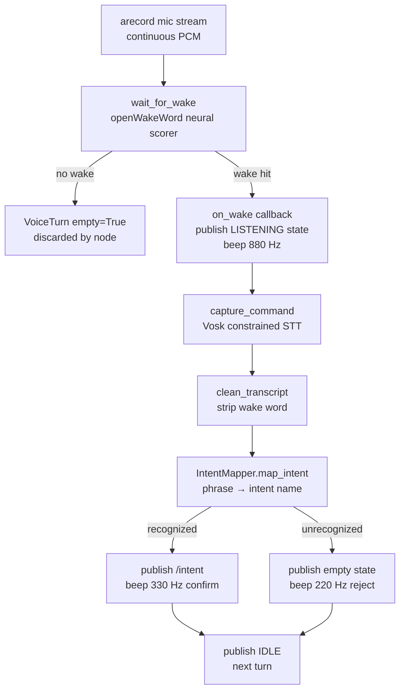

# dome_voice — Theory of Operation

## What This Package Is

`dome_voice` is a ROS-free voice pipeline for a mobile robot. It listens continuously for a wake word ("alexa"), captures a spoken command, maps the transcript to a structured intent, and hands the result to a ROS2 adapter that publishes it to the robot's intent bus.

The package is designed around one constraint: **testability without hardware**. The audio capture, wake detection, and speech recognition core (`runtime.py`) has no ROS dependency. The ROS adapter (`voice_input_node.py`) is a thin shell — roughly 100 lines — that wires the core into a ROS2 node. This means the entire pipeline can be unit-tested with mock audio, fake clocks, and no ROS installation.

## Package Layout

```
dome_voice/
├── runtime.py            # audio capture, wake detection, STT — no ROS
├── intent_mapper.py      # transcript → intent dict — no ROS, no audio
├── audio_feedback.py     # beep tones via aplay — no ROS
├── voice_input_node.py   # ROS2 adapter: wraps runtime, publishes /intent
└── speech_output_node.py # ROS2 adapter: subscribes /announcement, speaks via Piper
```

Dependency order: `audio_feedback` and `intent_mapper` are leaves. `runtime` depends on neither. `voice_input_node` depends on all three. `speech_output_node` is independent — it only needs ROS2 and the `dome_control` announcement contract.

## Theory of Operation

A single voice turn proceeds in four stages:



**Stage 1 — Wake detection.** `runtime.py` reads 1280-sample mono chunks from `arecord` at 16 kHz, scores each chunk with openWakeWord, and requires three consecutive above-threshold chunks before declaring a wake event. This suppresses single-frame noise spikes. A cooldown period after each wake drains buffered audio to prevent re-triggering.

**Stage 2 — Command capture.** After the wake event, `runtime.py` opens a Vosk `KaldiRecognizer` with a constrained JSON grammar (the eight recognized command words plus `[unk]`). It reads chunks until Vosk signals a final result, silence holds for `silence_secs`, or a timeout fires. The silence threshold is adaptive — it is computed from the 20th percentile of ambient dBFS readings taken during wake detection.

**Stage 3 — Intent mapping.** The raw transcript is passed to `IntentMapper.map_intent()`, which normalizes case, rejects `[unk]`, and scans a phrase table to produce a structured dict: `{"name": "turn_right", "source": "voice", "slots": {}}`. The phrase table is the single source of truth for recognized commands.

**Stage 4 — ROS publication.** `voice_input_node.py` publishes the intent dict as JSON on `/intent` and transitions the `/voice/state` topic through `IDLE → LISTENING → PROCESSING → SPEAKING → IDLE`. Audio feedback (beep tones) provides immediate local confirmation without requiring a display.

## Key Design Decisions

**No ROS in the core.** The pipeline was extracted from a larger ROS package (`control/voice/`) specifically to enable isolated testing. `VoiceRuntime.next_turn()` accepts `ok_fn` (a callable returning bool) instead of calling `rclpy.ok()` directly — in tests this is a lambda counter; in production it is `rclpy.ok`.

**Constrained grammar.** Vosk is used in constrained mode, not free-form transcription. The grammar contains exactly the words the robot understands. This gives near-perfect accuracy for in-vocabulary words and routes everything else to `[unk]`, which the intent mapper rejects cleanly.

**Adaptive silence threshold.** Rather than a fixed dBFS floor, the silence cutoff is computed per-turn from recent ambient readings. This makes the pipeline usable in different acoustic environments (quiet lab vs. noisy hallway) without retuning.

**Tuned parameters as a named constant.** `TUNED_VOICE_PARAMETERS` in `runtime.py` is the canonical default configuration, derived from hardware experiments. Operators can override it via a YAML file pointed to by `VOICE_TUNE_CONFIG` — but the in-code defaults are always a working starting point.

## Reading Guide

- **Chapter 1 (runtime.py)** — start here. The two-phase loop, audio preprocessing, wake detection, and command capture are all explained in depth.
- **Chapter 2 (intent_mapper.py)** — short. Covers the phrase table and matching logic.
- **Chapter 3 (voice_input_node.py)** — the ROS integration layer. Explains state publishing, beep feedback, and the main loop.
- **Chapter 4 (speech_output_node.py)** — the speech output adapter. Piper TTS synthesis, WAV gain scaling, and ALSA playback.
- **Appendix X01 (audio_feedback.py)** — reference only. Simple sine-wave generator piped to `aplay`.
