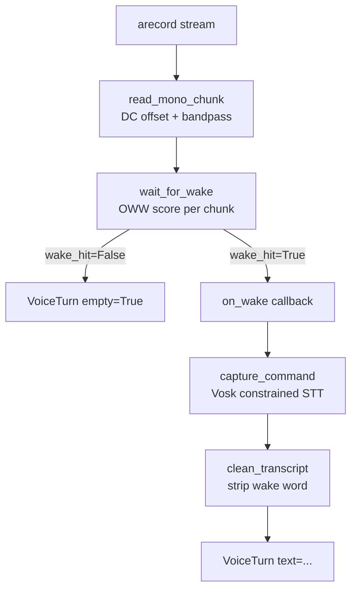

# runtime.py — Voice Pipeline Internals

## What This Module Does

`runtime.py` is the core of `dome_voice`. It runs a two-phase voice loop with no ROS dependencies: first it listens for a wake word (e.g. "alexa") using openWakeWord's neural scoring, then it captures and transcribes a spoken command using Vosk's constrained grammar recognizer. The result is a `VoiceTurn` dataclass that a ROS adapter (or any caller) can act on.

The module is deliberately ROS-free. The only ROS adapter is `voice_input_node.py`, which wraps `VoiceRuntime.next_turn()` in a ROS2 lifecycle node.

## Configuration

All tunable parameters live in `VoiceRuntimeConfig`, a frozen dataclass. The canonical defaults are the `TUNED_VOICE_PARAMETERS` dict at the top of the file — a cut-and-paste point from `~/tune` experiments on the actual hardware:

```python
DEFAULT_GRAMMAR = (
    "stop", "right", "left", "explore",
    "describe", "objects", "status", "help",
)

TUNED_VOICE_PARAMETERS = {
    "stream_settings": {
        "wake_word": "alexa",
        "threshold": 0.7,        # score per chunk to count as wake hit
        "wake_hits": 3,          # consecutive above-threshold chunks required
        "wake_cooldown_secs": 1.5,
        "grammar": list(DEFAULT_GRAMMAR),
        "silence_secs": 1.0,
        "max_command_secs": 8.0,
        ...
    },
    ...
}
```

`load_voice_runtime_config()` reads these defaults, or a YAML path from the `VOICE_TUNE_CONFIG` env var. It delegates field parsing to `config_from_tune_mapping()`, which handles nested YAML structure (`stream_settings`, `sox_chain`) and coerces types safely via `_as_int`, `_as_float`, `_as_bool`, etc.

## Two-Phase Loop

The pipeline separates wake detection from command capture. This matters because the wake model runs on every chunk continuously, while the STT model only activates after a wake event.

```
stream chunks ──► wait_for_wake() ──► on_wake callback
                        │
                        ▼
                 capture_command() ──► VoiceTurn
```

```python
def next_turn(self, ...) -> VoiceTurn:
    wake = wait_for_wake(self.stream, self.wake_model, ...)
    if not wake["wake_hit"]:
        return VoiceTurn(wake_score=wake["score"], ...)
    on_wake(wake)
    command = capture_command(self.stream, self.vosk_module, ...)
    return VoiceTurn(text=command["text"], ...)
```

## Wake Detection

`wait_for_wake` reads mono chunks from the mic stream, scores each chunk with openWakeWord, and requires `wake_hits` consecutive above-threshold chunks before declaring a wake event. This suppresses single-frame noise spikes.

A cooldown loop runs before scoring starts — it drains buffered audio and flushes the OWW sliding window to prevent the previous "alexa" from immediately re-triggering:

```python
if cooldown_s > 0:
    drain_end = time_fn() + cooldown_s
    while ok_fn() and time_fn() < drain_end:
        chunk = read_mono_chunk(stream, CHUNK, live_filter)
        wake_model.predict(chunk)  # flush sliding window
```

The noise window (a deque of dBFS values from below-threshold chunks) is passed to `capture_command` so the silence threshold can adapt to ambient noise.

## Audio Preprocessing

`read_mono_chunk` averages the two stereo channels to mono, removes DC offset, and optionally applies a `LiveBandpass` filter. The bandpass filter (highpass at 120 Hz, lowpass at 4000 Hz) matches the SoX chain used during `~/tune` experiments — the same signal path must be used in production or the model scores degrade.

```python
mono = stereo.mean(axis=1).astype(np.float32)
mono -= float(np.mean(mono))          # DC offset removal
chunk = np.clip(mono, -32768, 32767).astype(np.int16)
if live_filter:
    chunk = live_filter.process(chunk)
```

`LiveBandpass` is a simple first-order IIR implementation — fast enough for a 1280-sample chunk at 16 kHz.

## Command Capture

`capture_command` opens a Vosk `KaldiRecognizer` with a constrained JSON grammar (the `DEFAULT_GRAMMAR` words plus `"[unk]"` for out-of-vocabulary rejection). It reads chunks until one of three endpoints:

1. Vosk returns a final result (endpoint detection), command was long enough, and speech was heard.
2. Speech was heard, minimum duration passed, and silence held for `silence_secs`.
3. No speech started within `command_start_secs` (timeout before command begins).

```python
grammar_json = json.dumps((grammar or []) + ["[unk]"])
rec = vosk_module.KaldiRecognizer(stt_model, RATE, grammar_json)
```

The wake word is stripped from the transcript by `clean_transcript`, which checks if the transcript starts with the wake word and removes it:

```python
def clean_transcript(text: str, wake_word: str) -> str:
    words = text.split()
    wake_words = wake_word.replace("_", " ").split()
    if words[:len(wake_words)] == wake_words:
        return " ".join(words[len(wake_words):]).strip()
    return text
```

## Silence Threshold

The silence floor is adaptive. `noise_floor()` takes the 20th percentile of recent below-floor dBFS readings, then `silence_cutoff()` adds `silence_margin` dB (default 5 dB). This auto-tunes to the environment rather than requiring manual calibration.

```python
def silence_cutoff(noise_floor_value, override, margin) -> float:
    if override is not None:
        return override
    if noise_floor_value is None:
        return -38.0                            # safe fallback
    return min(noise_floor_value + margin, -22.0)  # cap: never too loud
```

## Data Flow Diagram



## Observations and Improvement Opportunities

- **`LiveBandpass` is a per-sample Python loop** — hot path for 1280 samples at 16 kHz. Replacing the explicit for-loop with a vectorized scipy `lfilter` call would be faster and more readable, with identical output.

- **`capture_command` is 78 lines** — over the 50-line target. The speech-endpoint state machine (silence tracking, chunk counting, break conditions) could be extracted into a small helper.

- **`from __future__ import annotations` was present** — removed; Python 3.12 supports `X | None` natively.

- **`main()` in a library module** — `runtime.py` contains both the core library and a smoke-test CLI. The checklist prefers standalone library modules have no `main()`. The smoke test CLI is useful for hardware iteration; could be split into a separate `smoke_test.py` if the file grows.

- **Grammar coupling** — `DEFAULT_GRAMMAR` must match `intent_mapper.py`'s phrase table. Currently kept in sync by convention; a single source of truth (e.g. exporting from `intent_mapper`) would prevent drift.
