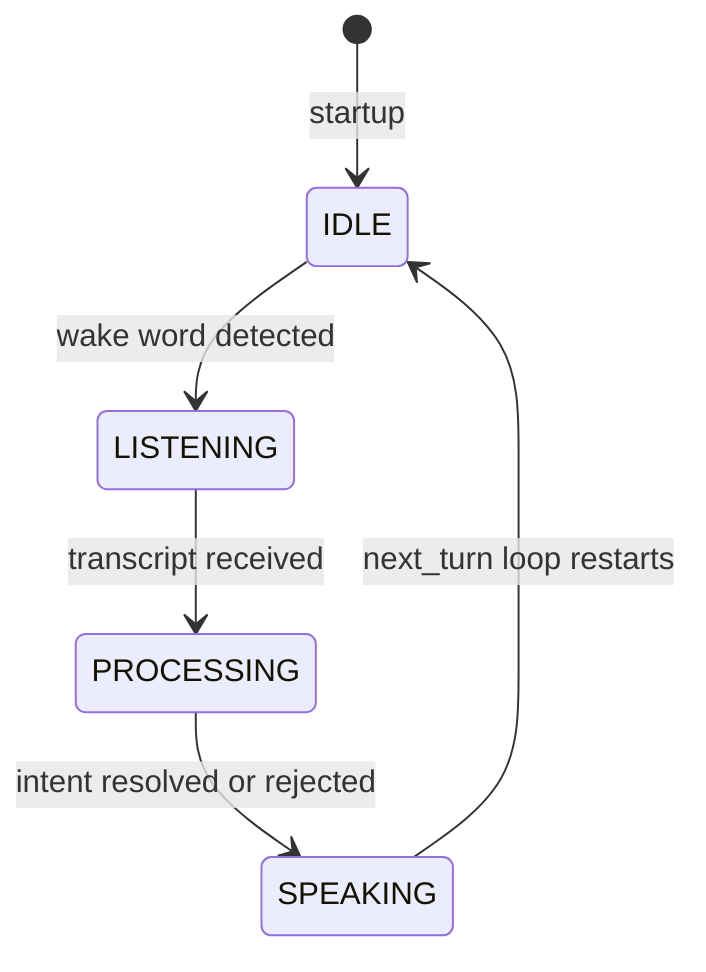

# voice_input_node.py — ROS2 Adapter

## What This Module Does

`voice_input_node.py` is the only ROS2-aware file in `dome_voice`. Everything below it (`runtime.py`, `intent_mapper.py`, `audio_feedback.py`) is ROS-free and testable in isolation. This file's sole job is to wire the voice pipeline into ROS2: spin a node, call `VoiceRuntime.next_turn()` in a blocking loop, and publish results to `/intent` and `/voice/state`.

The architectural boundary is intentional: isolating ROS here means the core pipeline can be unit-tested, reused, or replaced without any ROS dependency.

## Node Structure

`VoiceInputNode` extends `rclpy.node.Node` and owns two publishers:

```python
class VoiceInputNode(Node):
    def __init__(self):
        super().__init__("voice_input")
        self.intent_pub = self.create_publisher(String, "/intent", 10)
        self.state_pub  = self.create_publisher(String, "/voice/state", 10)
        self.intent_mapper = IntentMapper()
```

- `/intent` — JSON-serialized intent dicts (e.g. `{"name": "turn_right", "source": "voice", "slots": {}}`)
- `/voice/state` — plain string state transitions: `IDLE`, `LISTENING`, `PROCESSING`, `SPEAKING`

The node does not subscribe to anything. It is a producer only.

## State Machine

The voice pipeline moves through four states per turn:



State transitions are published via `publish_state()` so any downstream node can react (e.g. light ring, TTS feedback).

## Turn Processing

`process_turn` handles the full response to a completed `VoiceTurn`:

```python
def process_turn(self, turn: VoiceTurn, device_index: int = 0) -> None:
    if turn.empty:
        # no command heard after wake — log diagnostics, beep rejection tone
        self.publish_state("SPEAKING")
        beep(frequency=220, duration=0.15, device_index=device_index)
        return
    self.process_transcript(turn.text, device_index=device_index)
```

An empty turn means the wake word fired but no command was heard (silence timeout, OOV rejection, or `rclpy.ok()` returned False mid-capture). The node logs the noise floor and cutoff values from `turn.metadata` to aid tuning, then plays a low rejection beep.

For non-empty turns, `process_transcript` maps the text to an intent:

```python
def process_transcript(self, text: str, device_index: int = 0) -> None:
    intent = self.intent_mapper.map_intent(text)
    if intent:
        self.publish_intent(intent)
        self.publish_state("SPEAKING")
        beep(frequency=330, duration=0.02, device_index=device_index)  # short confirm
    else:
        self.publish_state("SPEAKING")
        beep(frequency=220, duration=0.15, device_index=device_index)  # low reject
```

Two distinct beep profiles signal success vs. rejection without requiring visual feedback.

## Main Loop

```python
def main():
    voice_config = load_voice_runtime_config()
    device_index = int(os.environ.get("VOICE_DEVICE_INDEX", voice_config.capture_card))

    rclpy.init()
    node = VoiceInputNode()
    runtime = VoiceRuntime(voice_config)

    try:
        node.publish_state("IDLE")
        while rclpy.ok():
            def on_wake(_wake):
                node.publish_state("LISTENING")
                beep(frequency=880, duration=0.02, device_index=device_index)

            turn = runtime.next_turn(ok_fn=rclpy.ok, on_wake=on_wake)
            if turn.metadata and not turn.metadata.get("wake", {}).get("wake_hit", False):
                break
            node.process_turn(turn, device_index=device_index)
            node.publish_state("IDLE")
    finally:
        runtime.close()
        node.destroy_node()
        if rclpy.ok():
            rclpy.shutdown()
```

`on_wake` is a closure defined inside the loop — it captures `node` and `device_index` from the enclosing scope and is passed to `runtime.next_turn()` so the LISTENING state publishes at the exact moment the wake word fires, before the STT phase begins.

The `break` condition handles the case where `rclpy.ok()` returned False mid-wake — `next_turn` returns a wake-miss turn rather than blocking forever.

## Observations and Improvement Opportunities

- **`on_wake` closure redefined every iteration** — harmless, but slightly wasteful. Extracting it as a method or defining it once before the loop is cleaner.

- **No lifecycle node** — using `rclpy.node.Node` directly means the node starts active immediately. A `LifecycleNode` would let the ROS graph bring it up/down cleanly (e.g. during robot bringup sequencing), but adds significant boilerplate for a node that has no meaningful inactive state.

- **`device_index` is unused in `VoiceRuntime`** — it's passed to `beep()` for audio output device selection, but `VoiceRuntime` uses `capture_card` from config for input. The naming is slightly confusing; `output_device_index` would be clearer.

- **`rclpy.ok()` passed as `ok_fn`** — this is the right pattern for testability: the runtime never imports `rclpy` directly. Any callable that returns bool works, making `next_turn` testable with a lambda counter.
